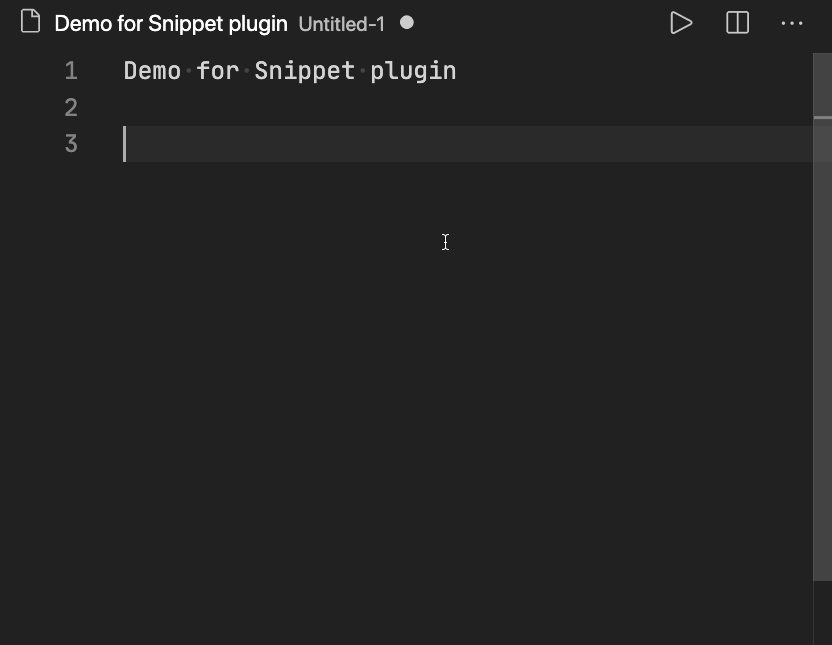

# [docs](index.md) » Snippet
---

Manage various kinds of snippets.



You can register snippets on Snippet.snippets.
The format is bellow:
```
{
    text = "TEXT",
    action = "ACTION_NAME",
    contents = "CONTENTS",
}
```
- text: index to choose snippet.
- action: "text" or "shell" or "hs" or "nest".
- contents: depends on ACTION_NAME.
  - text: directly used.
  - shell: evaluated as shell script.
  - hs: called as hammerspoon function.
  - nest: table of nested snippets.

e.g.
```
spoon.Snippet.snippets = {
  {
    text = "text: simple text",
    action = "text",
    contents = "simple text\n",
  },
  {
    text = "shell: echo Hello",
    action = "shell",
    contents = "echo Hello",
  },
  {
    text = "hs: hs.hash.MD5('string')",
    action = "hs",
    contents = function () return hs.hash.MD5("notify", "", "") end,
  },
  {
    text = "nest",
    action = "nest",
    contents = {
      {
        text = "text: nested text",
        action = "text",
        contents = "nested text",
      },
    },
  },
}
```

Download: [https://github.com/doiken/Spoons/raw/master/Spoons/Snippet.spoon.zip](https://github.com/doiken/Spoons/raw/master/Spoons/Snippet.spoon.zip)

## API Overview
* Variables - Configurable values
 * [snippets](#snippets)
* Methods - API calls which can only be made on an object returned by a constructor
 * [bindHotkeys](#bindHotkeys)
 * [init](#init)
 * [showSnippet](#showSnippet)
 * [toggleSnippet](#toggleSnippet)

## API Documentation

### Variables

| [snippets](#snippets)         |                                                                                     |
| --------------------------------------------|-------------------------------------------------------------------------------------|
| **Signature**                               | `Snippet.snippets`                                                                    |
| **Type**                                    | Variable                                                                     |
| **Description**                             | See description on top to see format and example.                                                                     |

### Methods

| [bindHotkeys](#bindHotkeys)         |                                                                                     |
| --------------------------------------------|-------------------------------------------------------------------------------------|
| **Signature**                               | `Snippet:bindHotkeys(mapping)`                                                                    |
| **Type**                                    | Method                                                                     |
| **Description**                             | Binds hotkeys for Snippet                                                                     |
| **Parameters**                              | <ul><li>mapping - A table containing hotkey objifier/key details for the following items:</li><li> show_snippet - Display the snippet chooser</li><li> toggle_snippet - Show/hide the snippet chooser</li></ul> |

| [init](#init)         |                                                                                     |
| --------------------------------------------|-------------------------------------------------------------------------------------|
| **Signature**                               | `Snippet:init()`                                                                    |
| **Type**                                    | Method                                                                     |
| **Description**                             | initializer                                                                     |
| **Parameters**                              | <ul><li>None</li></ul> |
| **Returns**                                 | <ul><li>Snippet</li></ul>          |

| [showSnippet](#showSnippet)         |                                                                                     |
| --------------------------------------------|-------------------------------------------------------------------------------------|
| **Signature**                               | `Snippet:showSnippet()`                                                                    |
| **Type**                                    | Method                                                                     |
| **Description**                             | Display the snippet in a chooser                                                                     |
| **Parameters**                              | <ul><li>None</li></ul> |
| **Returns**                                 | <ul><li>None</li></ul>          |

| [toggleSnippet](#toggleSnippet)         |                                                                                     |
| --------------------------------------------|-------------------------------------------------------------------------------------|
| **Signature**                               | `Snippet:toggleSnippet()`                                                                    |
| **Type**                                    | Method                                                                     |
| **Description**                             | Show/hide the snippet list, depending on its current state                                                                     |
| **Parameters**                              | <ul><li>None</li></ul> |
| **Returns**                                 | <ul><li>None</li></ul>          |

